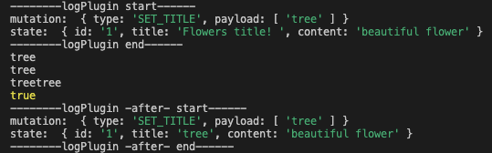
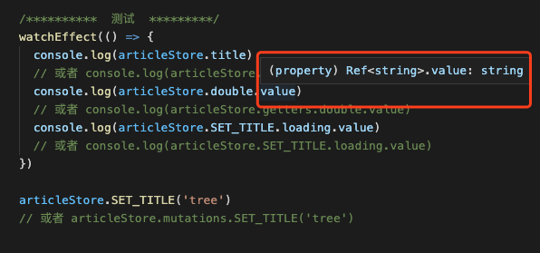
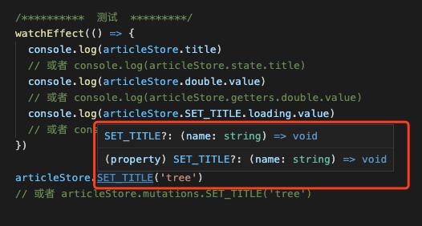

# 如果 Vuex 能完美支持TypeScript, 将是什么样的开发体验？

我们知道 **vue3** 对 **ts** 的支持已经非常友好了，但是 vuex 仍然不太支持 ts，没有类型检查和编辑器提示。既然如此，干脆我们尝试自己动手开发 **vuex-ts** 仓库源码：https://github.com/ruige24601/vuex-ts.git

### 1. 使用方法
```ts
import { computed, reactive, Ref, watchEffect } from 'vue'
import Vuex from '../src'
import logPlugin from './logPlugin'
// import devtool from './devtool'
// 状态的类型
interface State {
  id: number | string
  title: string
  content: string
}
// 计算属性的类型
interface Getters {
  double: Ref<string>
}
// 方法的类型
interface Mutations {
  SET_TITLE?: (name: string) => void
}
// 1. 安装插件(可选)
Vuex.install([logPlugin])
// 2. 创建store 。 可以多次调用 createStore 方法创建多个 store
const articleStore = Vuex.createStore<State, Getters, Mutations>(() => {
  const state: State = reactive({
    id: '1',
    title: 'Flowers title! ',
    content: 'beautiful flower',
  })

  const getters: Getters = {
    double: computed(() => state.title + state.title),
  }

  // 2.1 支持 同步和异步两种写法
  const mutations: Mutations = {
    SET_TITLE(title) {
      return Promise.resolve().then(() => {
        state.title = title
      })
    },
  }

  return {
    state,
    getters,
    mutations,
  }
})

/**********  测试  *********/
watchEffect(() => {
  console.log(articleStore.title)
  // 或者 console.log(articleStore.state.title)
  console.log(articleStore.double.value)
  // 或者 console.log(articleStore.getters.double.value)
  console.log(articleStore.SET_TITLE.loading.value)
  // 或者 console.log(articleStore.SET_TITLE.loading.value)
})

articleStore.SET_TITLE('tree')
// 或者 articleStore.mutations.SET_TITLE('tree')
```
#### 1.1 支持单向数据流
不能直接修改state中的数据。例如：执行 `articleStore.title = 'tree '` 会报错：**'can not set value directly: XXX'**
#### 1.2 支持插件系统
例如：使用`logPlugin`, 将在控制台打印：



#### 1.3 内置loading插件
例如： 调用`SET_TITLE` 这个异步方法， `articleStore.SET_TITLE.loading.value`的值将自动由 false -> true -> false 转变

#### 1.4 支持创建多个store
例如： 
```
const articleStore = Vuex.createStore(...)
const userStore = Vuex.createStore(...)
```

#### 1.5 支持vue风格的简写
例如：
`articleStore.state.title` 可简写为 `articleStore.title`
`articleStore.getters.double` 可简写为 `articleStore.double`
`articleStore.mutations.SET_TITLE` 可简写为 `articleStore.SET_TITLE`

#### 1.6 重点：近乎完美的支持 TypeScript 



### 2. 源码分析
#### 2.1. 如何实现 `articleStore.SET_TITLE.loading.value` 的类型声明?
```ts
interface loadingRef {
  loading: Ref<boolean>
}
interface MtWithLoading<M> {
  mutations: { [key in keyof M]: M[key] & loadingRef }
}

export interface Store<S, G, M> extends MtWithLoading<M> {
  state: S
  getters: G
  // mutations: MtWithLoading<M>
  _subscribers: []
  subscribe: any
  [key: string]: any
}
```
- 重点是将 mutations 改造成联合类型
- `[key in keyof M]` 表示 原始的 M 的键
- M[key] 表示 原始的 M 的值
- M[key] & loadingRef 联合类型 表示 在原始M的值的基础上增加loading属性

#### 2.2 如何实现 vue 风格简写的类型声明
```ts
const storePx: Store<S, G, M> & S & G & MtWithLoading<M>['mutations'] = (new Proxy(store, {
  get(target, key, receiver) {
    if (key in target.state) {
      return target.state[key]
    } else if (key in target.getters) {
      return target.getters[key]
    } else if (key in target.mutations) {
      return target.mutations[key]
    } else {
      return Reflect.get(target, key, receiver)
    }
  },
  has(target, key) {
    if (key in target.state) {
      return true
    } else if (key in target.getters) {
      return true
    } else if (key in target.mutations) {
      return true
    } else {
      return Reflect.has(target, key)
    }
  },
}) as unknown) as Store<S, G, M> & S & G & MtWithLoading<M>['mutations']
```
- 重点是 `Store<S, G, M> & S & G & MtWithLoading<M>['mutations']`在原始store上增加 `MtWithLoading<M>['mutations']` 的值的类型

**备注：** 源码地址：https://github.com/ruige24601/vuex-ts.git
